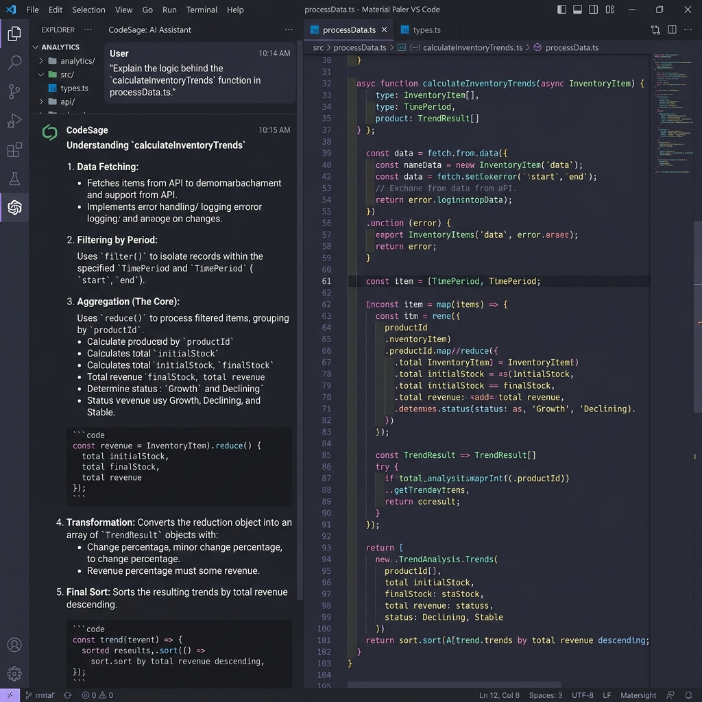

  <h1>🧠 CodeSage</h1>
  
<strong>AI Programming Assistant for VS Code</strong>

  

## 🚀 Overview
CodeSage is a next-generation VS Code extension powered by **Anthropic Claude**. It provides highly accurate, context-aware code completions and inline documentation by deeply understanding your entire workspace.

Unlike traditional copilot tools that only read the currently open file, CodeSage uses **Tree-sitter** to parse the Abstract Syntax Tree (AST) of your entire repository, generating semantic embeddings stored in a local **Vector Database (ChromaDB)**.

  

## ✨ Features
* **Workspace Indexing:** Parses Python, TypeScript, and JavaScript files to map out functions, classes, and logic.
* **Semantic Code Search:** Instead of regex matching, search your codebase using natural language.
* **Context-Aware Completions:** Pulls highly relevant snippets from across the repository to feed Claude's context window for hyper-accurate suggestions.

## 🛠️ Technology Stack
* **Extension Framework:** VS Code Extension API
* **Language Models:** Anthropic Claude 3
* **Code Parsing:** Tree-sitter
* **Vector DB:** ChromaDB
* **Frontend UI:** React (Webview)

## 💻 Getting Started
1. Clone the repository and run `npm install`.
2. Add your Anthropic API Key in `Settings > CodeSage`.
3. Press `F5` to open an Extension Development Host.
4. Run the command `CodeSage: Index Workspace` (Ctrl+Shift+I).
5. Open the CodeSage sidebar to chat, or start typing in the editor for intelligent inline completions!
